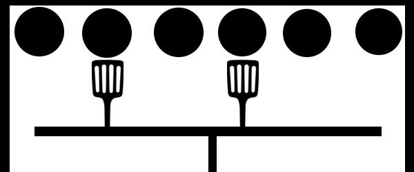

## Flippin' burgers
Spongebob Squarepants is hard at work flipping burgers at the Krusty Krab. In order to make the burgers perfect he has a special routine for cooking them; first cook them the perfect amount of time on one side, then flip them all and cook them the perfect amount on the other side. This doesn't sound hard, but the problem is sometimes he must cook as much as 16 burgers at the same time!

In an attempt parallellize the burger flipping, Spongebob has taped together multiple spatulas (_stekespader_) into what he calls a super-spatula. He's not very good at hand-crafting things, so unfortunately the super-spatula doesn't necessarily have a spatula for each burger (see image).


Since the super-spatula only barely fits inside the oven, he can't slide it over to flip the remaining burgers. To accomodate this, Spongebob has made more super-spatulas with different configurations. For instance, he can flip the remaining burgers in the image above by using the super-spatula in the image below.



Of course, it's not always as simple as in the case above. Sometimes the super-spatulas overlap, so burgers are flipped more than once. This is OK, as long as the burgers end up with the finished side facing up when Spongebob is done flipping.

Make a program that given a set of available super-spatulas, calculates the minimal number of flips Spongebob must make in order to flip all the burgers so they are facing up with the finished side.

## Input
The first line contains two integers _b_ and _s_ the number of burgers and super-spatulas, respectively.

Then follows _s_ lines, each with _b_ characters _s<sub>i</sub>_, the configuration of each of the super-spatulas. _s<sub>i</sub>_ can be either `#` or `.`, indicating that there is a spatula at position _i_ or not, respectively. Each super-spatula can consist of anything from 0 to _b_ spatulas, inclusive. There might exist duplicate super-spatulas.

## Output
Output the lowest number of flips Spongebob must perform in order to make all the burgers have the finished side facing up. If this is impossible simply output `Impossible`.

## Constraints
1 &le; _b_, _s_, &le; 16

## Sample input 1
```
4 6
##..
..##
##.#
#...
.#..
...#
```

## Sample output 1
```
2
```

## Sample input 2
```
4 2
###.
..##
```

## Sample output 2
```
Impossible
```