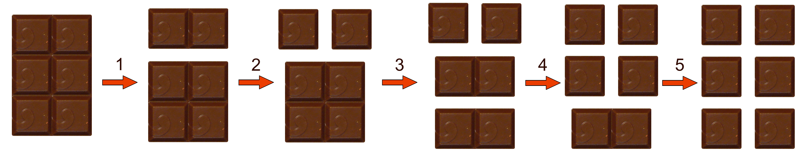

# Chocloate
Sverre loves chocolate, and he eats a lot of it. 
Actually, the only thing he eats is chocolate. Since chocolate is such a big
part of Sverre's life, he naturally spends much time on it, and the most time
consuming part is of course the chocolate bar splitting. Therefore he asks you
to help him optimizing the process.

The original chocolate bar consists of _R_ rows with _C_ pieces in each row.
Sverre has to divide it into _R_ * _C_ pieces by doing splits. 

A split is a simple process. Sverre picks one of the existing chocolate bars
with more than one piece, and divides it into two new chocolate bars by cutting
along one of the separator lines. 
The split process is done until all the pieces are separated.



Given _R_ and _C_, what is the least number of splits needed to turn the
original chocolate bar into _R_ * _C_ pieces.


## Input specification:
The first line of input contains one integer _R_, the number of rows in the chocolate bar.
The second line of input contains one integer _C_, the number of pieces in each row.

## Output specification:
Output one number, the least number of splits needed to divide the original chocolate bar into _R_ * _C_ pieces.

## Constraints
1 &le; _R_ &le; 10000  
1 &le; _C_ &le; 10000  

## Example 1 input:
```
2
3
```

## Example 1 output:
```
5
```


## Example 2 input:
```
3
4
```

## Example 2 output:
```
11
```

