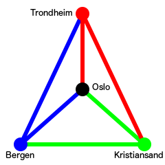

# Package delivery
Rune is a logistics manager at _Posten_'s regional office in Oslo. He is responsible for the packages going from Oslo to Kristiansand, Bergen and Trondheim. One of Rune's tasks is to assign each package to a suitable truck, and needs your help in doing so.



Rune has access to three trucks, so he can easily send a truck to each of the three cities. The problem is that not all types of packages can be put on the same truck. For instance, you don't put a package of dynamite on a truck loaded with a shipment of matches. If two types of packages can't be on the same truck, Rune calls them _incompatible_.

In an attempt to accommodate the incompatibility issue, Rune sends each to truck to two destinations, instead of one. One truck drives to Kristiansand and Bergen, another drives to Bergen and Trondheim and a third truck drives to Trondheim and Kristiansand.

Your task is to create a program that calculates if it is possible to ship a given set of packages to their destinations with this setup.

## Input specification
The first line of input contains a single integer _n_, the number of packages.

Then follows a line containing _n_ words, the destination of each of the packages. The destination is either `Kristiansand`, `Bergen` or `Trondheim`.

Then follows _n_ lines describing the incompatibility of the packages. The _i_-th line, describing package _i_, consists of a list of up to _n_ - 1 distinct integers. These are the indices of the packages package _i_ is incompatible with.

Note that if package _i_ is incompatible with package _j_, then package _j_ is also incompatible with package _i_. A package cannot be incompatible with itself.

## Output specification
Output a single line containing either `Possible` or `Impossible` indicating if it is possible to ship all the packages to their destinations while fulfilling all of the compatibility requirements.

## Constraints
1 &le; n &le; 100
## Sample input 1
```
7
Kristiansand Kristiansand Kristiansand Bergen Trondheim Bergen Trondheim
1 5 6
0 2
1 3
2 5
6
0 3
0 4
```

## Sample output 1
```
Possible
```
## Sample input 2
```
3
Kristiansand Kristiansand Kristiansand
1 2
0 2
0 1
```

## Sample output 2
```
Impossible
```
