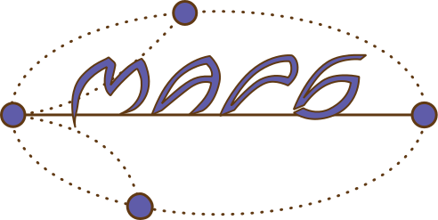

# Election day 1


### Note:
This is one of two problems named "Election day". These problems (i.e. "Election day 1" and "Election day 2") differ only by their input constraints. 
See section "Constraints".

## Problem text


Tomorrow is election day at MAPS and the time has come to choose a new leader for the organization.
There is, however, one problem: how to pick a leader when every reasonable person wants to be the new leader?
In such a case, every person at the election would simply vote for herself.



Yang (the mathematician) suggests an easy process to pick the new leader.
It goes as follows:
the _N_ candidates will place themselves at positions 1 through _N_ on a line. 
Then every second person (starting at the second position) is consecutively eliminated.
The eliminated candidates then leave the line with the remaining candidates taking positions 1, 2, ... .
If the last person on the previous line was eliminated, the process restarts as before on the second person.
If not the process restarts on the first person.
This continues until there is only one candidate left.


For example, if _N_=5 the candidate's initial positions are 1,2,3,4 and 5.
The first candidates to be eliminated are at positions
2 and 4.
They leave the line.
Then candidate at position 1 stays, the candidate at 3 goes to position 2 and the candidate at 5 goes to position 3, so the new line will consist of positions 1,2 and 3.
The process then restarts at position 1.
The candidates at positions 1 and 3 are now eliminated.
There is only one candidate remaining, on position 2.
This is the new leader.

The board is extremely happy they now have a way to choose a new leader!

Little do the board know of Yang's wicked plans.
He will calculate the position of the new leader on the initial line and place himself there.

## Input specification
The input consists of a single number _N_ on a single line, the number of candidates showing up.

## Output specification
Output on a single line, one number, _i_, Yang's position on the initial line.

## Constraints
1 &le; _N_ &le; 10<sup>5</sup>

1 &le; _i_ &le; _N_ .


## Sample input 1
```
5
```
## Sample output 1
```
3
```

 
## Sample input 2
```
1
```
## Sample output 2
```
1
``` 
