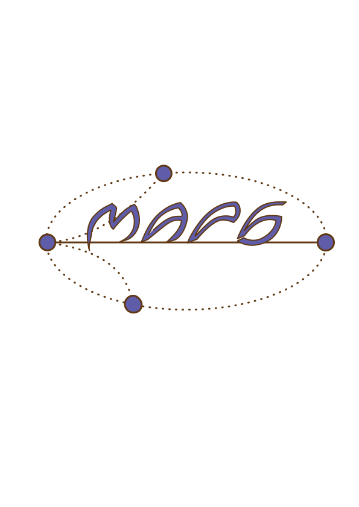

#Election day#

Tomorrow is election day at MAPS and the time has come to choose a new leader for the organization.
There is however, one problem: how to pick a leader when every reasonable person wants to be the new leader?
In such a case, every person at the election would simply vote for herself.



Yang (the mathematician) suggests an easy process to pick the new leader.
It goes as follows:
the _N_ candidates will place themselves at positions 1 through _N_ on a line
and then every second person (modulo _N_ that is not already eliminated and starting at the second position)
will consecutively be eliminated until there is only one candidate left.


For example, if _N_=5 the candidate's positions are 1,2,3,4 and 5.
The first candidates to be eliminated are at positions
2 and 4.

Then those at positions
1 and 5
follow, so the person at position 3 becomes the next leader.

The board is extremely happy they now have a way to choose the new leader!

Little do they know of Yang's wicked plans.
Yang knows all MAPPERS to be reasonable, but he is not sure how many persons will be present at the election.

##Input specification##

The input consists of _T_ lines.
Each line is a possible number of candidates showing up.

##Output specification##
For each possible number of candidates the position of the new leader.


##Constraints##
1 &le;_T_ &le; 400

Small input:
1 &le; _N_ &le; 10^5

Large input:
1 &le; _N_ &le; 10^15


Output:
For each entry _N_ in the table output the position _i_ where Yang would place himself.

1 &le; _i_ &le; _N_.


##Sample input##
```
1
3
5
```
##Sample output:##
```
1
3
3
``` 
