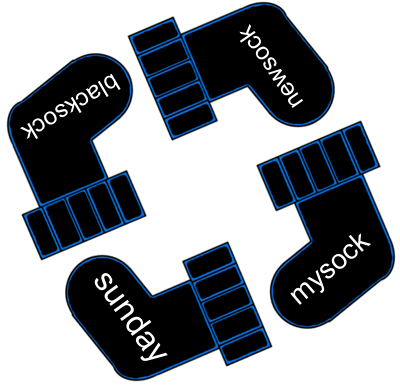

# Socks
Matias works as a programmer, and like most programmers these days, he spends a lot of time working in his terminal window. When Matias is not at work, he sits at home trying to figure out what to wear at work the next day, because for Matias it is very important to be classy and look good. Since the background of his terminal is black, he always wear black socks at work to make sure that he matches the computer.



With a drawer full of black socks, it is very hard to find matching pairs, so Matias has come up with a very smart system. Every time he buys a new pair of socks, he picks a random word and make sure that both of the new socks are marked with that word. This way, he can check easily if two socks are a match, simply by looking at the word written on the socks. Once in a while he buys many socks that are all equal. Then it does not really matter which of them he pairs together, so he marks them all with the same word.

Like every other person, Matias has a washing machine which eats socks. So after he has washed them, he collects them all to throw away socks that can not be paired together with any other sock anymore. Matias wants make a program which does this for him, but since he is not very good with algorithms (he only configures servers at work), he asks you to help him. Of course he wants to throw away as few socks as possible.

## Input specification:
The first line of input contains one integer _N_, the number of socks Matias has.
Then follows N lines with one string on each line. The string on line _i_ represents the text written on the _i_'th sock. The strings will only contain the lowercase letters a-z.

## Output specification:
Output a list sorted alphabetically with all the socks Matias has to remove. If he does not need to remove any socks, output "Sock-sess"

## Constraints
1 &le; _N_ &le; 100000  

## Example 1 input:
```
6
tuesday
monday
tuesday
monday
saturday
saturday
```

## Example 1 output:
```
Sock-sess
```


## Example 2 input:
```
4
redsock
bluesock
bluesock
bluesock
```

## Example 2 output:
```
redsock
```


