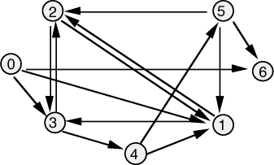

# Traveling Salesman

This is a story about an young salesman called Erlend. He loves to travel, but got an obsession. He always keeps
a lists of the roads he are allowed to travel. He is not allowed to travel any roads that are not on his list.
All roads are only one-way travelable. This means that if the road from city A to city B is in his list, it does not necessarily mean that he can travel from city B to city A, but he can travel a road multiple times.

The question is: Is it possible for Erlend to visit all the cities and then return to the city he starts in?

## Input:
(Note: The cities are numbered from 0 to N-1.)

* The input starts with N - numbers of cities (max 10 000)
* Followed by M - number of allowed roads on his list
* Followed by M lines with two integers A and B, the one-way road from A to B. Given `2 4` there is a one-way road from city 2 to city 4.

## Ouput:

    YES 
  
if he can visit all the cities and return, and 

    NO
    
otherwise.

### Example 1:

#### Input
    
    2
    2
    0 1
    1 0

#### Output

    YES

### Example 2:

#### Input

    3
    2
    0 1
    1 2

#### Output

    NO
